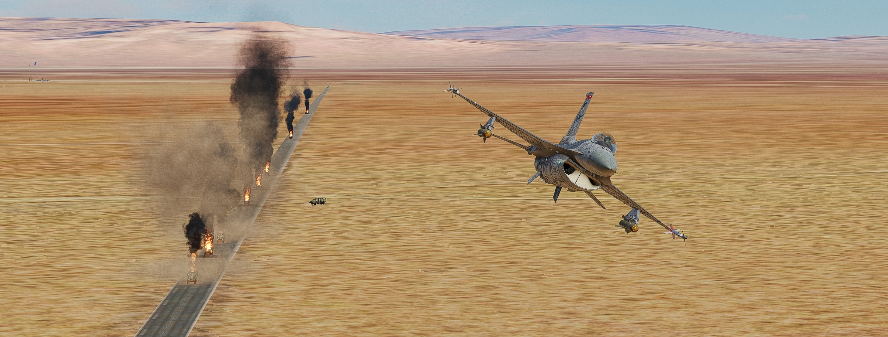

# Digital Air Combat

Digital Air Combat is a completely server-side, and vaguely modular, set of scripts designed to create a more "gamey" version of DCS to encourage higher speed, a more forgiving PVP environment, and closer range action than is typical for DCS, even with modern aircraft. At its core, it's built around using *highly* curated aircraft and plane sets.

This is absolutely not for everyone. It's a very radical approach to DCS, but it's an idea that's been floating around in my head as I've played across many DCS servers, and thinking about the things I liked and disliked across them.

**TL;DR: What if DCS but Ace Combat?**

Each module is explained in more detail below, but listed here are the main features of each:

- `AceHP`: Hitpoints system that can be applied to all aircraft
- `AceAmmo`: Loadout system to allow planes to carry more weapons for less weight/drag
- `AceSplash`: Simple splash damage script to boost the destructive power of air to ground munitions
- `AceEagleEye`: Voiced "AWACS" callouts for things such as incoming missiles or low ammo

The HP and Ammo scripts are the core to this entire experience and to build the gameplay that I was aiming for. The Splash and Eagle Eye scripts are more for flavoring and "polish" and are less essential.

## What are the gameplay implications?

### A band-aid for the ground fire accuracy problem?

By chance, the HP system actually addresses one of my biggest problems with ground attack in DCS. In DCS, every vehicle is perfectly accurate no matter if it's a radar guided Gepard or a guy with an AK. As long as you are within their engagement ring, you will received perfectly aimed and accurate fire. For aircraft that rely on dumb fired weapons, and necessarily have to get close (helicopters especially suffer from this), this makes it risky beyond reason to use dumb fired weapons.

With the HP system in place, getting tagged by the DshK on top of a T-55 while flying past at mach 1 isn't a death sentence. It'll reduce your HP, but it won't outright *kill* you the way it so often happens in DCS. While testing these scripts, I found it a very welcome change.

### Multiple ejector racks are a choice to trade weight/drag for burst damage.

Infinite ammo works on a per-launcher/rack basis in DCS. A rack doesn't get physically reloaded until every munition on it has been fired. Since aircraft get the same amount of ammo no matter how many of a store is loaded, there isn't really *that* much of a benefit from carrying 6 Mk82s versus just a pair.

However, depending on mission design, you might want to trade off the extra weight/drag for the ability to drop multiple munitions in a single pass. For example, when flying against a convoy, 2 bombs vs 6 bombs is the difference between destroying most or all of it in a single pass.

### The gun is way better.

Because of the damage boost that the gun gets against ground targets in the `AceSplash` module, the gun is much more useful against ground targets than it previous was. When combined with infinite ammo, it's a very viable way to destroy ground targets if you're either out of ammo or have some kind of purely air to air loadout.

Dogfights also should be a bit more reliant on the gun because the HP system and missile warnings will make it more likely for planes to get "too close for missiles". With the HP system, the gun is also the fastest way to kill a jet at full HP since all you need is a solid burst and don't have to wait for the reload. If nothing else, a glancing hit will usually take off a significant portion of HP and greatly reduce the number of missiles to kill the target.

### Dogfights with more modern jets aren't over in seconds.

Modern missiles, even if you're only talking about an AIM-9L (which is what in my tests/demo I treat as the "standard" missile) are extremely lethal due to their maneuverability, all-aspect nature, and warheads.

With `AceHP`, a single missile hit no longer results in automatic death. You'll want to do the "double tap" instead if you think there's a high chance of killing the target with a salvo, and (by default) it will still take two salvos to kill a player jet. This wouldn't be practical without the `AceAmmo` module making it possible to carry 10 air to air missiles.

With the `AceEagleEye` module, you get a warning for every launch. AIM-9Ls are reasonably susceptible to flares, especially from head on, and since you can't get stealth launched on anymore, you will always have a chance to react.

Coupling all this together, you get fights which last longer, at closer ranges, and can often get into a situation where the planes are "too close for missiles" and have to resort to guns. Guns are also still the only way to "stealth" kill another aircraft, and guns are infinite ammo.

### Radar missiles don't play well.

I couldn't figure out how to get radar guided missiles to work nicely with this. If you have more than 2 air to air missiles (e.g. 4) then you'd be able to "alpha strike" another plane and basically kill it a single salvo. Better games will balance this by having long range missiles easier to dodge, but this just isn't the case in DCS. With only a handful of exceptions, most radar guided missiles are more difficult to evade due to not being spoofable by countermeasures, and often being just as manevuerable as Sidewinder.

I did try some things, such as limiting the range of radar guided missiles (to make them a sort of super missile), a mechanic that is still implemented into `AceAmmo`, but it wasn't enough and doesn't feel good. AMRAAMs are particularly problematic because they are in many ways more effective than an AIM-9L, even in WVR. There aren't many situations where the Sidewinder would connect that an AMRAAM wouldn't.

Ideally, I could tweak the stats of missiles to make this work better, but that's not practical in DCS. A Cold War setting, using planes which have access to worse missiles, is the closest thing to a real solution this has. However these scripts and demo mission sidestep the issue entirely by simply not allowing their use.

## How to use

Load the scripts that you want to use into your DCS mission. It's important that the `AceBase` script is loaded last, but otherwise you can pick and choose. For example, if you don't care for the respawning weapons, but still want to have some kind of HP system and have your own splash script (or don't want to use any), you can load only `AceHP` and `AceBase` in that order.

I highly recommend checking out each of the files yourself, as they will likely require customization for your mission. In particular, each one maintains small "databases" to give properties to things. E.g. `AceAmmo` requires data to know how to handle loadouts on various aircraft.

# Technical Overview

The Digital Air Combat is broken down into separate modules, with all them plugging into the required `AceBase` module.

## AceBase

By itself, this module only handles as an event manager, and a tracker for aircraft. **Load this script last.**

There is an untested `Ace.ENABLE_HELICOPTERS` option which will cause all the scripts to apply for helicopters.

## AceHP

Uses DCS' immortal/invulnerability setting to create a hitpoint system DCS. When airborne, aicraft become invincible and until their HP has been depleted, cannot be damaged through normal means. Missile impacts and gun hits deplete a configurable amount HP.

When on the ground, aircraft become vulnerable and the HP system is totally bypassed to allow for both destruction from crashing into the ground, and to allow for aircraft to be destroyed while landed.

On takeoff/landing from a friendly airfield, HP is automatically restored.

### Options

- `AceHP.DEFAULT_HP = 100`: If there is no data for an aircraft, this is the HP used.
- `AceHP.DAMAGE_MISSILE_A2A = 50`: Any air to air missile fired by an aircraft.
- `AceHP.DAMAGE_MISSILE_SAM = 50`: Any missile fired from a SAM.
- `AceHP.DAMAGE_MUNITION_A2G = 1000`: Any bomb, rocket, or AGM.
- `AceHP.DAMAGE_CALIBER_MULTIPLIER = 1.0`: HP damage applied by bullets depends on caliber. A value of 0.5 means a 20mm shell will do 10 damage.
- `AceHP.DESTROY_ON_HP_ZERO = true`: Sometimes when a plane runs out of HP, the thing that killed it won't apply the damage because it doesn't become vulnerable "fast enough". Enabling this causes an explosion at a random point near the plane to make sure it goes down when the HP reaces zero. This only affects missiles.
- `AceHP.DESTROY_EXPLOSION_POWER = 10.0`: Strength of the destroy on HP zero explosion. High values can totally obliterate the plane.
- `AceHP.PLAYER_HP_MULTIPLIER = 2.0`: Can be used to set players apart from AI.

## AceAmmo

The most complicated of the scripts, but it's conceptually very simple. It uses DCS' "Unlimited Weapons" option to add a game ammo system to the aircraft.  For example, an F-16 can physically load 2 AIM-9L, and 6 Mk82s, but this counts for 10 AIM-9s and 24 Mk82s. When an aircraft's ammo is depleted, the weapons can no longer be fired (they are despawned on launch). Reloading can be accomplished by calling the validateLoadout function.

This script is meant to be very specifically tuned for the mission and for balance. By default, loadouts follow these rules:

1. On aircraft spawn, and takeoff from a friendly airfield, loadouts get validated.
2. Only **TWO** types of weapons may be loaded onto the plane at once. Typically this is an AIM-9 + some A-G weapon.
3. Weapons must be loaded **in pairs** or else they are invalid. E.g. you cannot load a single Mk84 onto a plane and have it count.
4. Each aircraft has individual ammo counts for each weapon **type**, not based on how many are on the jet.
5. After firing, the ammo is deducted, and when ammo is depleted, the weapon cannot be fired again **even if it is physically loaded**.
6. To replenish ammo counts, you must land and take off again from a friendly airfield.

Also worth noting is an optional parameter for each weapon called `timeToLive` as defined in the `AceAmmo.AMMO_DATA` table. This value is an override for how long the weapon will exist after firing, and can be used to enforce shorter engagement ranges. By default, this is only enabled for Sidewinders, and not by much, but this was part of an attempt to [make radar missiles usable](#radar-missiles-dont-play-well).

### Options

`AceAmmo.USE_AMMO_DATA_AS_WHITELIST = true`: When true, if any weapon that HAS NOT been registered in AMMO_DATA is fired from the given plane, it will be removed as if it was out of ammo.

`AceAmmo.MAX_NUMBER_OF_WEAPON_TYPES = 2`: Puts a hard limit on the different TYPES that can be loaded onto a plane.  This is a very gamey way of limiting things to prevent the trick of loading one example of every type of weapon and then having a crazy arsenal.

`AceAmmo.TRACK_AMMO_ONLY_ON_PLAYERS = true`: When true, AI are allowed to fire an infinite number of any weapons. When false they obey the same ammo rules as players do.

`AceAmmo.REQUIRE_WEAPONS_LOADED_IN_PAIRS = true`: When true, a weapon is not considered loaded onto the plane unless there are two examples of it on the plane. Can be used to prevent weird loadouts.

`AceAmmo.DEFAULT_LOW_AMMO_COUNT = 4`: Fallback for when the ammo count for a weapon drops below this value, and if the AceEagleEye module is active, then it will report that ammo is low.

## AceSplash

Support script that applies extra damage to air to ground munitions, to make them easier to use and more effective at taking out tightly grouped targets. It's a *very* simple and naive implementation when compared to the more commonly used [WheelyJoe Splash Damage](https://github.com/wheelyjoe/DCS-Scripts) and [Grimm's Splash Damage 2.0 fork](https://github.com/spencershepard/DCS-Scripts) scripts.

This script is based around DCS' `hit` event. Basically if an explosive weapon causes damage to anthing, then the full power of that weapon is applied directly to the object. This makes for a fairly binary "damaged or not".
The biggest advantage of this script's approach is that it works for cluster munitions and aircraft cannons.

1. By default, without overrides, this does NOT affect air to air missiles or SAMs.
2. Gun damage is optional, and by default, affects only ground targets.
3. If something would have done no damage (e.g. M61 on a T-72) then no extra damage is applied. This nicely balances things IMO.
4. An error message is thrown when the script encounters something it doesn't know how to handle. See SPLASH_DATA for more information.

### Options

- `AceSplash.ENABLE_GUN_SPLASH = true`:
Can be used to disable extra splash damage on guns if desired. Splash damage makes the guns more effective on targets they would have already killed. If the gun was never going to penetrate the target, no explosive damage is applied.
- `AceSplash.ENABLE_GUN_DAMAGE_ON_AIRCRAFT = false`: Aircraft are fragile enough that applying the extra splash damage to them doesn't really make a lot of sense IMO, but it's here if you want it.
- `AceSplash.MUST_BE_FIRED_FROM_AIRCRAFT = true`: When true, splash is only applied to air launched weapons.

## AceEagleEye

Support script that provides voice callouts for incoming missiles, to confirm kills, and can be used in conjunction with the ammo script to give voice callouts for ammo status.

- Missile Incoming Warning (has text message as well)
- Missile hit target
- Missile Ammo Low/Empty
- Special Weapon Low/Empty
- Friendly Fire Hit
- Kill Plane
- Kill SAM
- Kill AAA
- Kill Vehicle
- Kill Tank
- Kill Ground Target
- Kill Generic Target (fallback)

**THIS REQUIRES VOICE CLIPS THAT I CANNOT UPLOAD TO THIS REPO.**

This one is not super configurable right now, but the code is pretty straightforward and should be easy to edit. To use your own audio, add your own equivalent voice clips to your missions `.miz` file and adjust the paths as necessary.

If a voice clip is missing, DCS won't throw an error or break, so this script is safe to run even if it's missing the files. Though, it won't look like it's doing anything other than a quick incoming missile text message.
